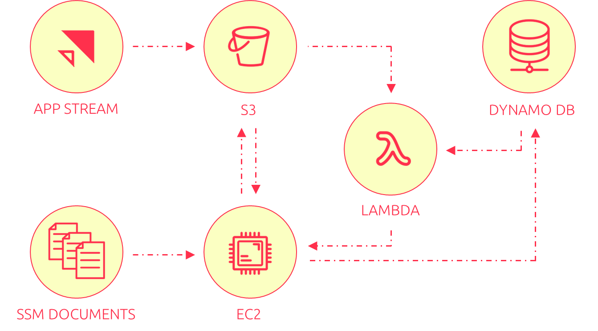

# AWS-Appstream-disk-management

Welcome to the Appstreak Disk Management Code Demo! This repository contains the code and resources presented in the [presentation](https://awscommunityday.nl/2024/sessions/acd320/) on 3/10/2024 at the AWS Community day.

## 📋 Overview
The AWS Appstream Disk Management solution effectively automates an AWS-provided step-by-step guide on how you can increase your Appstream Application Settings VHDX files. The original guide can be found [here](https://docs.aws.amazon.com/appstream2/latest/developerguide/administer-app-settings-vhds.html).

The provided code contains a few core components:
1. **AWS Eventbridge Scheduler**: This will act as the (nightly) trigger to start the automation.
2. **AWS Lambda Function**: The Lambda contains all logic to determine whether (new) users need their Application Settings drive increased, to prepare a batch of such users and to start the EC2 host which will effectively perform these operations. The Lambda function is written in Python
3. **AWS DynamoDB Table**: A serverless database which acts as our persistent logbook on the status of all users files. As Users drives are increased, it will be noted into the DynamoDB table and act as input to the Lambda as it determines which users have not received their increase yet.
4. **EC2 Instance**: The instance that effectively performs the disk-increase operations on the VHDX files. This system will only run when it is required (which is determined by the lambda function).
5. **SSM Document**: The SSM document contain the script that needs to be run on the EC2 Instance. 

## ⚠️ Important Notice
This repository is shared as-is:

No updates will be made.
No bug fixes will be provided.
No further maintenance is planned.
We encourage you to explore the code at your own pace and adapt it as needed.

## 📚 Documentation
For detailed instructions on how the code works, please refer to the  [terraform-docs.md](docs/terraform-docs.md) file in this repository. You’ll find information about the inputs, resources and any version-requirements.

## 🗓️ Repository Availability
This repository will remain open until April 1st 2025. After this date, the repository may be archived or removed, so make sure to download or clone it before then if you wish to keep a local copy.

Thank you for attending the presentation! Feel free to explore this code and please reach out with any feedback or questions.